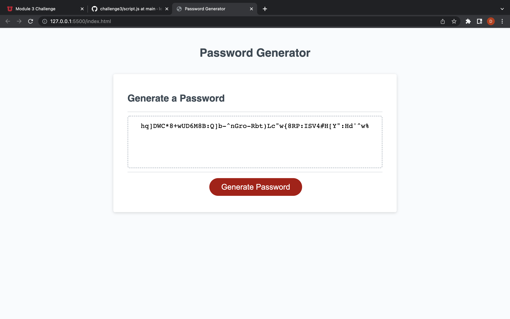

# UofU Coding Bootcamp Challenge 3#

## Welcome

to the third challenge. This will be a refactoring of some code, and the 
addition some new lines of javascript, in order to make a random password 
generator. I spent much of the project working in a separate, sandbox-mode 
script3.js file to be able to work out the rough outline of how the eventual 
script would work. After I got that down I linked that second script and 
was relieved to find it didn't interfere with the first one. 

The script collects the parameters of the password first and then, upon 
clicking the big red button, writes it to the text field.

### Link
[index.html](https://leftyloosey.github.io/challenge3/)

### Screenshot
